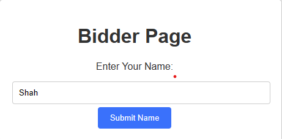
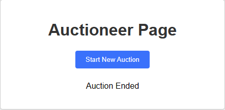

# Project Title

Simple-Auction

## Description

A real-time web application that allows auctioneers to create an auction for an item and that allows multiple bidders to bid on that item in real-time. The auctioneer starst an auction for an item with a name, price and and time limit, and when the auction is started all bidders who have inputted their name before the auction starts will be able to bid. The auctioneer will get updates 

### Dependencies/Stacks

* Node.js
* Express.js
* Socket.IO
* HTML and CSS
* JavaScript
* npm

### Installing

- Clone the repository
- npm install in the directory 
- You can use node server.js to start the server 
```
node server.js
```

### Using the program

* After the server is started Go to localhost:3000/bidder however many times to set up how many bidders you want to participate in the auction 
* You will be met with a waiting for the next auction to begin message for the bidders
* Go to localhost:3000/auctioneer on another window/tab and set up an auction
* After inputting the details of the auction and submitting the auction the auctioneer and bidder will get their own interface 
* The bidders can now place bids and in their interface they can actively see the highest bidder and highest bid in real time. 
* If a bidder places a bid too low they will get an error message accordingly
* The auctioneer will also be able to see details such as highest bidder and highest bid as well as a history of the bids


### Images
- Enter bidder name when you access localhost:3000/bidder

- Waiting message you will get when you enter in the name

- Auctioneer interface for starting an auction when you access localhost:3000/auctioneer

- Auctioneer interface after you start an auction


- Bidder interface when an auction is started

- Bidder tries submitting bid that is too low

- Bidder sets highest bid

- Auction results 


- Auction end for the auctioneer


- Auction end for the bidder


